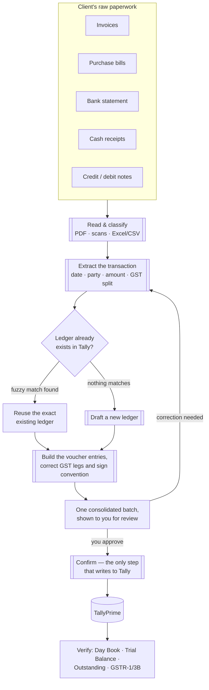
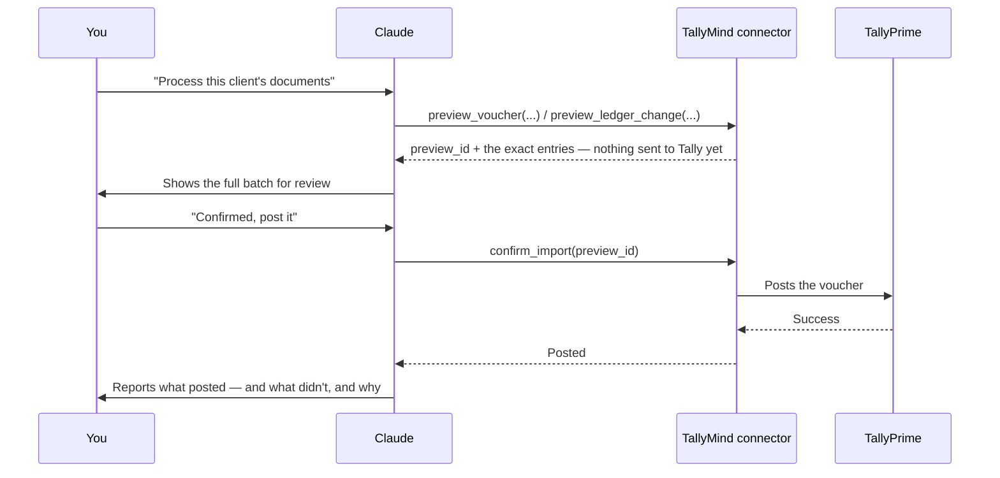

# TallyMind — turn a client's paperwork into TallyPrime books, from Claude

**Hand Claude a folder of invoices, bills, and bank statements. It drafts GST-correct Tally
vouchers, shows you the entire batch before touching anything, and posts only what you approve.
Then ask it anything about the books, in plain English.**

[](LICENSE)


- **Documents in, vouchers out.** PDFs, scanned images, Excel/CSV bank statements — classified,
  GST-split, and drafted as review-ready Tally vouchers.
- **Books in, plain English out.** Trial Balance, P&L, Day Book, outstanding bills, GSTR-1/3B —
  ask instead of clicking through Tally's menus.
- **Nothing posts on its own.** Every single write is preview-first: Claude shows you the exact
  change and waits for your go-ahead before anything reaches Tally.

`tally-plugins` is free, open-source, and installs as one Claude plugin — skills, config, and the
small local program that talks to Tally, all together. Nothing about your books is sent anywhere
except the Claude conversation you're having.

```powershell
irm https://raw.githubusercontent.com/Wadhawnaiya/tally-plugins/main/install.ps1 | iex
```

That one line gets Claude talking to Tally. To also get the two skills that teach Claude the
*procedure* — document-to-voucher drafting, GST conventions, the preview-then-confirm discipline —
install the full plugin bundle; see [Install](#install) for both routes.

---

## Contents

- [Why this exists](#why-this-exists)
- [The accounting workflow](#the-accounting-workflow)
- [What it handles](#what-it-handles)
- [What makes TallyMind different](#what-makes-tallymind-different)
- [What data it can see and touch inside Tally](#what-data-it-can-see-and-touch-inside-tally)
- [Requirements](#requirements)
- [Install](#install)
- [Check it's working](#check-its-working)
- [Example things to ask](#example-things-to-ask)
- [How the safety model works](#how-the-safety-model-works)
- [Full capability reference](#full-capability-reference)
- [Troubleshooting](#troubleshooting)
- [Under the hood](#under-the-hood)
- [Development](#development)
- [License](#license)

---

## Why this exists

TallyPrime doesn't talk to AI assistants on its own, and turning a client's raw paperwork into
correctly-coded vouchers is normally an hour of manual data entry per client per period. A handful
of open-source bridges between Tally and AI tools already exist, but every one we could find
shares the same rough edges: hardcoded to `localhost` (breaks the moment Tally runs on a different
office PC), no way to tell *why* a connection failed, nothing built for GST work specifically,
session settings that reset on every restart, and — worst of all for a non-developer — an install
that means downloading a zip and hand-editing a JSON config file, backslash escaping and all.

TallyMind fixes all of that, does the document-to-voucher drafting work that used to be manual,
and is free for anyone to use, fork, or build on.

## The accounting workflow

This is the whole pipeline, from a client's folder of paperwork to a reviewed, posted entry in
Tally:



Step by step:

1. **Read.** Point Claude at a folder — PDFs and scanned images are read natively (no OCR step),
   CSVs are read as-is, and Excel files are converted with a dependency-free script.
2. **Classify & extract.** Each document is matched to a voucher type (sales invoice, purchase
   bill, bank line, receipt, credit/debit note) and its transaction data is pulled out — date,
   party, amounts, and the correct CGST/SGST-vs-IGST split.
3. **Resolve ledgers.** Every party, tax, and expense ledger a transaction touches is looked up by
   fuzzy name first. An existing ledger is reused exactly as spelled in Tally; only a genuinely
   missing ledger gets drafted.
4. **Build the entries.** Debit/credit legs are assembled with the correct sign convention and GST
   treatment, one voucher per transaction.
5. **One batch, one review.** Every drafted ledger and voucher — GST split, party, amount,
   narration — lands in a single table before anything is confirmed. A transaction that can't be
   confidently matched to a party (e.g., a bank line naming nobody in the batch) is flagged as
   **unresolved**, never silently posted as a guess.
6. **Confirm what you approved.** Ledgers post before vouchers that reference them; each item is
   confirmed individually and reported back individually — one failure never hides inside an
   overall "done."
7. **Verify.** Ask about the Day Book, Trial Balance, or a party's outstanding balance to confirm
   the batch landed the way you expected.

The preview → confirm step in the middle is the one safety-critical moment, so it's worth seeing
on its own:



A `preview_id` is single-use — replaying an old or invalid one fails rather than silently
reposting, and anything you didn't approve simply expires unconfirmed.

## What it handles

| Client's document | Tally voucher | GST treatment |
|---|---|---|
| Sales invoice | `Sales` | CGST+SGST (intra-state) or IGST (inter-state), booked as output tax |
| Purchase bill | `Purchase` | GST booked to an Input ledger, recoverable via input credit |
| Bank line — money in | `Receipt` | Matched to the customer ledger; which specific invoice it settles is flagged for manual bill-matching in Tally |
| Bank line — money out | `Payment` | Matched to a vendor ledger, or booked straight to an expense head |
| Cash expense receipt | `Payment` | Usually no GST (unregistered supplier) |
| Credit note | `Credit Note` | Reverses the sale and its output GST |
| Debit note | `Debit Note` | Reverses the purchase and its input GST |
| Bank ↔ cash transfer | `Contra` | No GST — internal transfer between own accounts |
| Accountant's own adjustment | `Journal` | No GST — reclassification only |

Full worked examples (exact entries, sign convention, GST split arithmetic) live in
[`cowork-plugin/skills/tally-doc-import/references/voucher-mapping.md`](cowork-plugin/skills/tally-doc-import/references/voucher-mapping.md),
and ledger-naming/parent-group conventions in
[`references/gst-and-ledgers.md`](cowork-plugin/skills/tally-doc-import/references/gst-and-ledgers.md).
Try the whole thing risk-free with the bundled [demo client](#try-it-without-a-real-clients-documents)
before pointing it at real books.

## What makes TallyMind different

| | Most existing Tally MCP servers | TallyMind |
|---|---|---|
| **Install** | Download a zip, manually edit `claude_desktop_config.json`, restart Claude | One PowerShell command does everything |
| **Connecting to Tally on another PC** | Hardcoded to `localhost` — breaks if Tally is on a different machine | Host and port are configurable (`set_connection`) |
| **When something's wrong** | A raw connection error, or silently wrong data | `tally_doctor` tells you plainly what's broken and how to fix it |
| **Posting entries** | Often "just does it," or leaves safety entirely up to you remembering to back up first | Every write is preview-first: nothing touches Tally until you explicitly confirm |
| **Client document → voucher drafting** | Not covered — you type every entry by hand | `tally-doc-import` reads a folder of paperwork and drafts the whole batch |
| **GST work** | Not covered | Dedicated GSTR-1/GSTR-3B and mismatch-review tools |
| **Restarting the server** | Forgets which company/connection you were using | Remembers your last connection and company automatically |
| **Finding a ledger by a rough name** | You have to know the exact spelling | Fuzzy search — "VRO" finds "VRO Technology" |

## What data it can see and touch inside Tally

This matters more than almost anything else in this document, so it gets its own section.

- **TallyMind only ever talks to the TallyPrime instance you point it at**, over TallyPrime's own
  built-in HTTP/XML interface (the same interface Tally's official developer tools use). By
  default that's `localhost:9000` — your own computer, nothing external.
- **Nothing about your Tally data is sent anywhere except to the Claude conversation you're
  having.** There is no cloud relay, no third-party server, no telemetry. It's a small program that
  runs entirely on your machine.
- **Read access**: whatever company is currently open/loaded in TallyPrime — its ledgers,
  vouchers, Balance Sheet, Profit & Loss, Trial Balance, Day Book, Stock Summary, outstanding
  bills, and (best-effort — see below) GST return data. It cannot see companies you haven't
  opened, and it cannot see anything Tally itself wouldn't show to whatever user account Tally is
  running as.
- **Write access is real but gated.** Ledgers and vouchers *can* be created or altered — but never
  in one step. Every write is a two-stage **preview, then confirm**: the preview builds the exact
  change and shows it to you first, and nothing is sent to Tally until you (or Claude, on your
  explicit instruction) call confirm with that specific preview. There is no tool that mutates
  Tally data in a single call.
- **GST reporting is honestly best-effort.** TallyPrime doesn't publicly document the exact data
  format its GST reports return over this interface, so these tools are marked `best_effort` in
  their own output and come with a note to cross-check against Tally's own GST screens — it will
  not pretend to a level of certainty it doesn't have.
- **You control the scope.** `set_connection` and `set_company` point at exactly the Tally
  instance and company you intend — nothing happens automatically in the background.

## Requirements

- **TallyPrime, Silver or Gold edition** — not the Educational edition, which silently truncates
  date ranges and will feed Claude plausible-looking but wrong numbers.
- Tally's HTTP/XML gateway enabled: in TallyPrime, go to **F1 (Help) → Settings → Connectivity →
  Client/Server configuration**, set "TallyPrime acts as" to **Server** (or **Both**), and note
  the port (default `9000`).
- **Windows**, since TallyPrime itself only runs on Windows.
- **Claude Desktop** and/or **Claude Code**, installed on the same PC as TallyPrime.

## Install

There are two routes in, and they're complementary rather than either/or — most people want both.

### Route 1: get Claude talking to Tally (PowerShell, one line)

Open TallyPrime, load your company, and make sure the gateway setting above is on. Then open
**PowerShell** and run:

```powershell
irm https://raw.githubusercontent.com/Wadhawnaiya/tally-plugins/main/install.ps1 | iex
```

Here's exactly what that one line does, step by step, so nothing is a mystery:

1. **Checks for Python 3.10+.** If it's missing, installs it automatically via `winget`.
2. **Installs TallyMind itself** (`pip install`, straight from this repository).
3. **Looks for your running Tally gateway** at `localhost:9000`. If it doesn't find one, it asks
   you once for the right port rather than failing silently.
4. **Registers TallyMind with Claude Desktop** by safely reading and rewriting
   `claude_desktop_config.json` — your existing config is backed up first, and the file is only
   ever edited through proper JSON parsing, never by pasting text into it, so it can't get
   corrupted the way hand-editing sometimes does.
5. **Registers with Claude Code too**, if you have it installed.
6. **Runs a connection self-test** and tells you plainly whether everything is ready.

When it finishes, **fully quit Claude Desktop** (from the system tray, not just closing the
window) and reopen it, so it picks up the new server.

This route gets you the raw tools (`tally_doctor`, `list_ledgers`, `preview_voucher`, and so on) —
enough for Claude to read and write your books if you describe what you want in detail.

### Route 2: the full plugin bundle (skills included)

The two Claude skills — `tally-mind` and `tally-doc-import` — are what teach Claude the actual
*procedure*: which order to call things in, the sign convention for voucher entries, GST ledger
conventions, the preview-then-confirm discipline. They ship as `cowork-plugin/` in this repo,
pre-packaged as a zip containing the plugin manifest, both skills, and their supporting
scripts/references together.

**1. Download the bundle:**

[`tallymind-cowork-plugin-v0.2.0.zip`](https://raw.githubusercontent.com/Wadhawnaiya/tally-plugins/main/dist/tallymind-cowork-plugin-v0.2.0.zip)

**2. Install it, however you use Claude:**

- **Cowork or Claude Desktop** — go to **Customize → Plugins**, use the option to install/upload a
  plugin from a file, and point it at the zip you just downloaded.
- **Claude Code** — Code installs plugins from a marketplace source rather than a raw zip. Unzip
  the download into its own folder, then add a small `marketplace.json` next to it:

  ```json
  {
    "name": "tallymind-marketplace",
    "plugins": [
      { "name": "tallymind", "source": { "type": "directory", "path": "./tallymind-cowork-plugin-v0.2.0" } }
    ]
  }
  ```

  Then, inside Claude Code:

  ```
  /plugin marketplace add /path/to/marketplace.json
  /plugin install tallymind
  ```

Either way, this is what actually gets you `tally-doc-import`'s document-to-voucher workflow, not
just the bare tools from Route 1 — and since TallyPrime only ever listens on the PC it's running
on, the `tallymind` connector itself still needs Route 1 run on that same Windows machine.

### Try it without a real client's documents

`demo/` ships a complete fictitious client — invoices, bills, a credit note, a debit note, a cash
receipt, and a bank statement — sized to exercise every voucher type `tally-doc-import` handles,
including one deliberately unresolved bank line to prove nothing gets guessed. Point it at a
**throwaway/test Tally company**, not real books, and follow [`demo/README.md`](demo/README.md)
end to end: process the folder, review the batch, confirm, then check the result with
`tally-mind`.

## Check it's working

Ask Claude:

> Using TallyMind, run tally_doctor and tell me if I'm connected.

You should get back a plain-language status: whether Tally is reachable, whether a company is
loaded, and a reminder about the Educational-edition caveat above.

## Example things to ask

- "Process the invoices and bank statement in C:\Clients\VRO Technology\July, then show me the
  batch before posting anything."
- "Using TallyMind, what's my Trial Balance look like right now?"
- "Which ledgers have unusually large closing balances?"
- "Show me overdue debtors past 90 days."
- "Pull the GSTR-1 and GSTR-3B summary for April 2026 and the Day Book for the same period so I
  can compare them."
- "Preview a sales voucher dated today for ₹10,000 against VRO Technology, then show me the
  preview before you touch anything."

## How the safety model works

Every tool that only *reads* data runs freely — there's nothing to protect there. Every tool that
*writes* data works in two separate steps, shown in the [sequence diagram above](#the-accounting-workflow):

1. **Preview** (`preview_ledger_change` or `preview_voucher`) builds the exact XML that would be
   sent to Tally and hands back a `preview_id`. Nothing has touched Tally yet.
2. **Confirm** (`confirm_import`) is the only tool that actually posts to Tally, and it requires
   that exact `preview_id`. A preview can only ever be confirmed once — replaying an old or
   invalid ID fails rather than silently reposting.

As always with accounting software: this produces a review-ready change, not a replacement for a
qualified professional's review before anything is finalized for compliance or client reporting
purposes.

## Full capability reference

Claude picks the right tool from plain English — you don't need to know these names — but the
full list is here for anyone who wants it.

<details>
<summary>Expand for all 20 tools, grouped by purpose</summary>

**Check the connection**
- `tally_doctor` — is Tally reachable, is a company loaded, plus an honest reminder to confirm
  you're not on the Educational edition.
- `set_connection` — point at a specific Tally host/port instead of the default `localhost:9000`.
- `set_company` — set which company subsequent questions apply to.

**Read your books**
- `list_companies`, `list_ledgers` (with fuzzy name search), `get_ledger`, `list_vouchers`
- `get_balance_sheet`, `get_profit_and_loss`, `get_trial_balance`, `get_day_book`,
  `get_stock_summary`, `get_outstanding` (overdue receivables/payables)

**GST**
- `get_gstr1_summary`, `get_gstr3b_summary` — best-effort GSTR summaries for a period
- `find_gst_mismatches` — pulls the GST return summary and the Day Book for the same period side
  by side, so a CA can spot-check them together, rather than fabricating a false-confidence
  "mismatches found" count Tally's data doesn't reliably support yet

**Make changes (always preview first)**
- `preview_ledger_change` / `preview_voucher` — build the exact change, return a preview ID,
  touch nothing
- `confirm_import` — the only tool that actually writes to Tally, and only with a valid preview ID

**Escape hatch**
- `raw_gateway_request` — send a raw XML request directly, for anything the above doesn't cover

**Document import** (`tally-doc-import` skill, orchestrates the tools above)
- Reads a folder of mixed-format documents, classifies each one, extracts the transaction, and
  drives `preview_ledger_change` / `preview_voucher` / `confirm_import` for the whole batch. See
  [The accounting workflow](#the-accounting-workflow) for the full procedure and
  `cowork-plugin/skills/tally-doc-import/SKILL.md` for the source of truth.

</details>

## Troubleshooting

**"TallyPrime XML gateway unavailable"** — Open TallyPrime, load a company, and confirm
**F1 → Settings → Connectivity → Client/Server** is set to Server or Both with the right port.
Run `tally_doctor` again after fixing this.

**Claude doesn't see the TallyMind tools at all** — Make sure you fully quit and reopened Claude
Desktop after installing (a window close isn't enough — quit from the system tray).

**Installer says Python or winget isn't available** — Install Python 3.10+ manually from
[python.org](https://python.org), then re-run the install command.

## Under the hood

The two skills never talk to Tally directly. Every read and every write goes through a small,
local **MCP** (`tally-plugins` implements the [Model Context Protocol](https://modelcontextprotocol.io))
server, `tallymind`, that gives Claude a guarded connection to TallyPrime's own HTTP/XML gateway.
`tally-doc-import` orchestrates it for document batches; `tally-mind` calls it directly for
conversational reading and writing. It's an implementation detail rather than something you need
to interact with — the workflow above is what actually matters day to day.

```
Claude  <── plain English ──>  You
   │
   │  MCP tool calls (preview → confirm)
   ▼
tallymind (local process)
   │
   │  HTTP/XML, localhost by default
   ▼
TallyPrime
```

Repo layout, in brief:

- `cowork-plugin/` — the installable plugin: the manifest (`.claude-plugin/plugin.json`), MCP
  server config, and both skills (`tally-mind`, `tally-doc-import`) with their reference docs and
  scripts.
- `src/tallymind/` — the MCP server itself (connection/session state, fuzzy ledger search,
  reports, guarded writes, diagnostics).
- `demo/` — the fictitious client used to try the whole workflow end to end.
- `install.ps1` — the one-line Windows installer.
- `dist/` — the pre-packaged plugin bundle zip (see [Route 2](#install)) — rebuild it by zipping
  `cowork-plugin/`'s contents whenever the skills or manifest change.

## Development

```bash
pip install -e ".[dev]"
pytest
```

`install.ps1` is Windows-only and can't be exercised in a Linux dev environment — review it
manually and test it on a real Windows + TallyPrime machine before trusting changes to it.

## License

[MIT](LICENSE) — free for anyone to use, modify, and distribute, commercially or otherwise.
